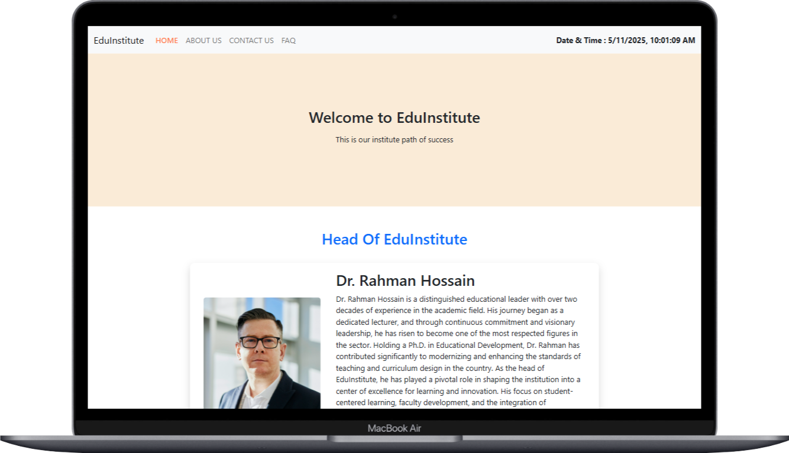

# Educational Institute Website

 <!-- Replace with your actual screenshot -->


This project was developed as a part of the **"Web Design and Development for Freelancing - NSDA - Level 3 (Batch No: 10)"** program. The objective was to create a **fully responsive Educational Institute Website** using **HTML, CSS, JavaScript, and Bootstrap**.

## 🚀 Features

- 🏫 Clean, professional multi-page layout
- 📚 Homepage with banner, head image, course listings, and gallery
- 👩‍🏫 About Us section with staff profiles and institute details
- 📬 Contact form with validation and confirmation popup
- ❓ FAQ section with JavaScript-controlled collapsible answers
- 🍲 Styled unordered list of winter foods using custom CSS (no framework)
- ⌚ Live current date and time display via JavaScript
- 🌐 Fully responsive and mobile-friendly design
- 🔗 External links with `target="_blank"`

## 🛠️ Technologies Used

- **Frontend**: HTML5, CSS3, JavaScript (ES6)
- **Framework**: Bootstrap 5
- **Tools**: Git, GitHub

## 📄 Pages Included

1. **Homepage**  
   - Banner, head of institute section  
   - Course details (3 items)  
   - Image gallery (6 items)

2. **About Us**  
   - Institute introduction with image  
   - Staff profile cards (3 profiles)

3. **Contact Us**  
   - Contact form with confirmation popup  
   - Address, Email, Phone info in styled cards

4. **FAQ Page**  
   - 5 JavaScript-collapsible questions  
   - One question includes a styled unordered list
   
5. **Full container wide navigation menu with mouse hover effect.**

6. **Confirmation popup window when submitting the contact form.**
7. **CSS framework.**

8. **Unordered list of food items using CSS styles (Background color,       Hover     effect, Border, Radius,without using framework help).**

9. **External link with 'target' blank attribute.**

10. **Current Date & Time using JavaScript.**

11. **Include External CSS & JavaScript file.**

12. **Internal pages linking.**


## 🧑‍💻 Installation / Setup

1. **Clone the repository**
   ```bash
   git clone https://github.com/devnhpiash/edu-institute.git
   ```
2. **Navigate to the project folder**
    ```bash
    cd edu-institute
    ```
3. **Open `index.html` in your browser**
   - You can simply double-click on the `index.html` file or use a local server like Live Server in VS Code.

## 📁 Project Structure
```
edu-institute/
├── index.html              # Homepage
├── about.html              # About Us page
├── contact.html            # Contact page
├── faq.html                # FAQ page
├── assets/
│   ├── images/             # All image files
│   └── css/
│       └── style.css       # Custom styling
├── js/
│   └── script.js           # FAQ toggle & date/time
└── README.md               # Project documentation
```

---

## 🙌 Contributing

Contributions, issues, and feature requests are welcome!  
Feel free to check the [issues page](https://github.com/devnhpiash/edu-institute/issues) if you'd like to collaborate.

---

## 📄 License

This project is open source and available under the [MIT License](LICENSE).

---

## 📬 Contact

If you like this project or have any questions, feel free to reach out!

- GitHub: [@devnhpiash](https://github.com/devnhpiash)
- Email: developer.nhpiash@gmail.com

---

🌟 Thanks for visiting! Proudly built for the NSDA Freelancing Program (Level 3 - Batch 10)